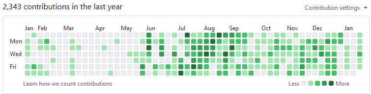

[\[English\]](/index_en.html)

## Обо мне

- Программирование — это моё призвание; я пишу код как на работе, так и в своё удовольствие
- 4 года коммерческого опыта, 10 лет всего (см. [историю на гитхабе](https://github.com/girvel))

### Навыки

- Читаемый и легко поддерживаемый код [\[1\]](https://github.com/girvel/fallen/blob/6403fa1b2e065861b3e76af4e1edf1e8ad09c3f0/tech/sound.lua) [\[2\]](https://github.com/girvel/ldump/blob/f644aafafadd49ca258d605bfaa1c05379577d30/init.lua) и документация [\[3\]](https://github.com/girvel/ldump/blob/f644aafafadd49ca258d605bfaa1c05379577d30/README.md)
- Языки: Python, C#, Lua как основные языки для коммерческой разработки, множество других языков на любительской/вспомогательной основе (C, Rust, JavaScript, ...)
- Основной бекенд стек: FastAPI, Tarantool, Flask, PostgreSQL, Git, Docker, Shell, Linux
- Человеческие языки: Русский, Английский (технический/разговорный)

## История работы

### Бэкенд фриланс

- Авг 2023 - Дек 2024
- Брал перерыв от работы с фиксированным графиком чтобы подлечиться
- Бэкенд разработка на Python+FastAPI и Lua+Tarantool
- Личные проекты (см. [fallen](#fallen))

### Бэкенд (финтех) - OneMarketData

- Фев 2022 - Июл 2023
- Обработка и анализ биржевых данных
- Разработка экосистемы для проприетарной БД
- Интересные клиенты: Нью-Йоркская фондовая биржа, Credit Suisse, FCA

### Фуллстек - Лаборатория Кода

- Ноя 2020 - Окт 2021
- Фуллстек разработка для flask+plotly
- Разработка внутренних CLI утилит
- Django, Flask, Docker

### Стажёр - Лаборатория Кода

- Сен 2020 - Ноя 2020
- Питон разработка для веба и ML, парсинг

## Портфолио

### [ldump](https://github.com/girvel/ldump)

Библиотека гибкой сериализации для Lua, поддерживающая все типы данных

- Тщательно задокументирована
- Тщательно покрыта тестами
- Единственная библиотека сериализации для Lua, поддерживающая все теоретически возможные кейсы

### [looper](https://github.com/girvel/looper)

Утилита командной строки для отслеживания повторяющихся задач (для персонального использования); написана на Rust-е с использованием сочетания TOML + cron-выражения.

- Минималистичная, полностью решает задачу, не создаёт лишней комплексности

### [fallen](https://github.com/girvel/fallen)

2D мини-RPG/приключение; самописный движок на основе LOVE.

- Разработана в небольшой команде как некоммерческий личный проект
- 17500 строк кода (из которых 12500 это код движка), 1300 коммитов
- Асинхронный скриптовый движок
- Использует LDtk для визуального редактирования уровней

## Контакты

- Email: [widauka@ya.ru](mailto://widauka@ya.ru)
- Telegram: [@girvel](https://t.me/girvel)
- Github page: [@girvel](https://github.com/girvel)
