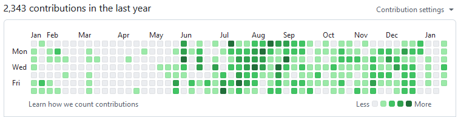
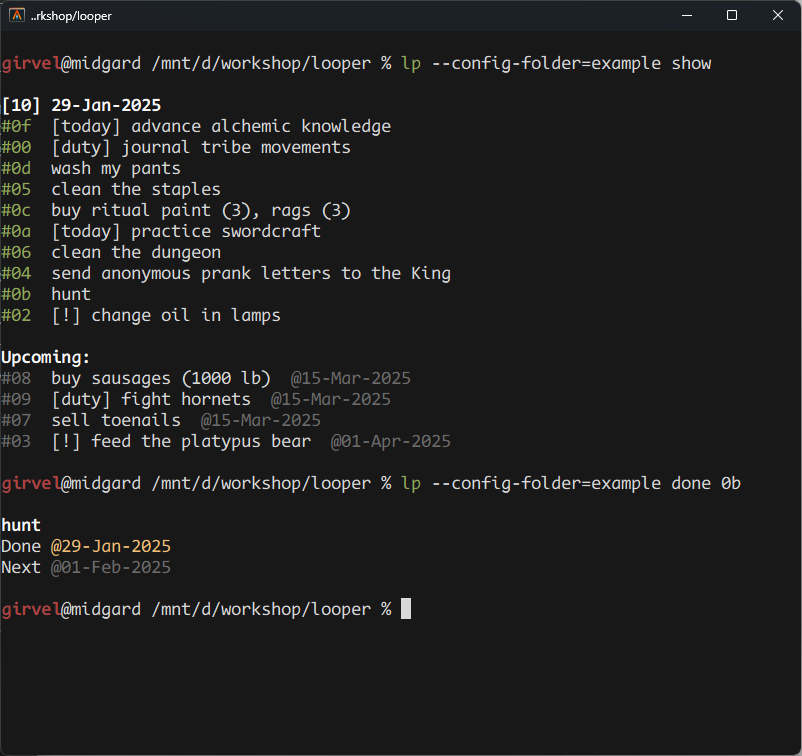
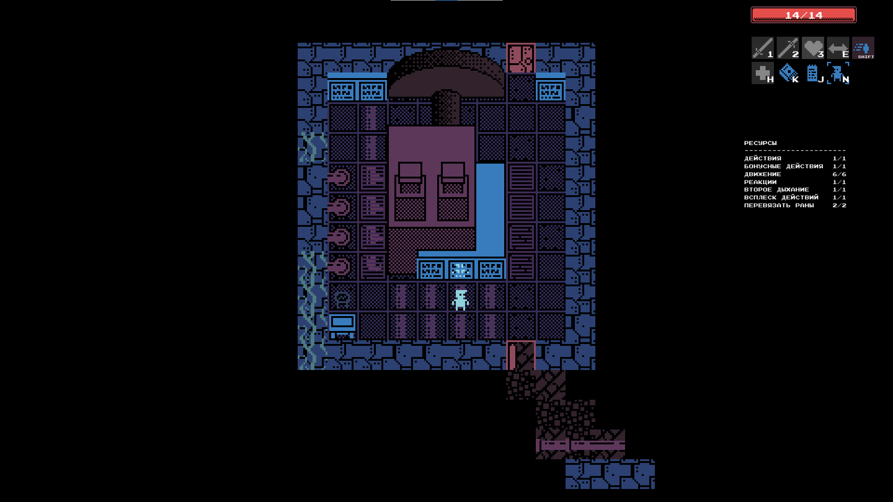
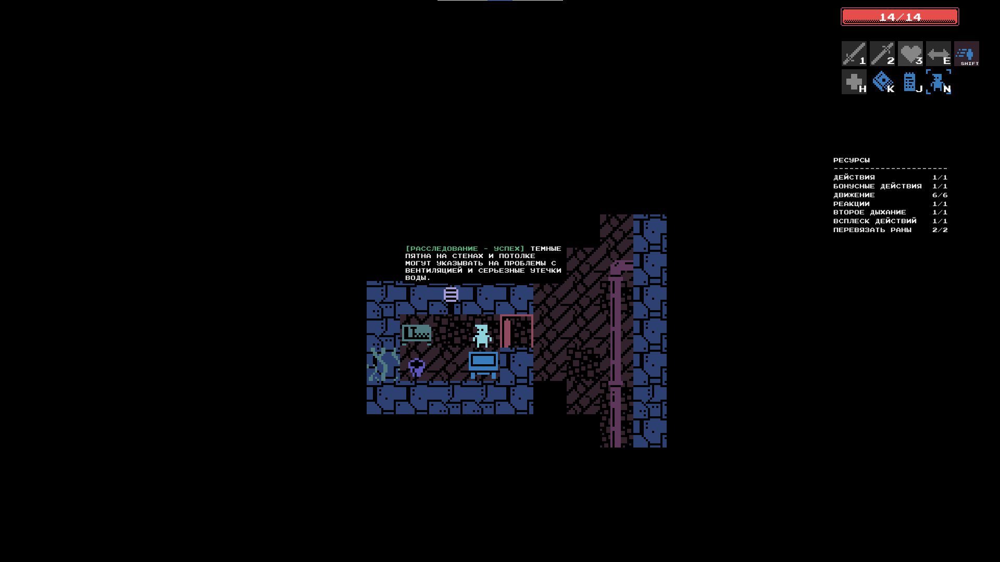
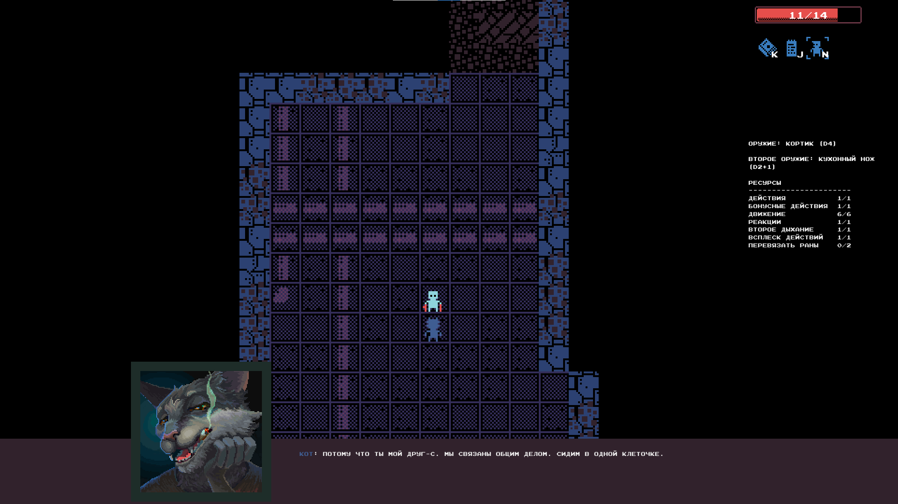
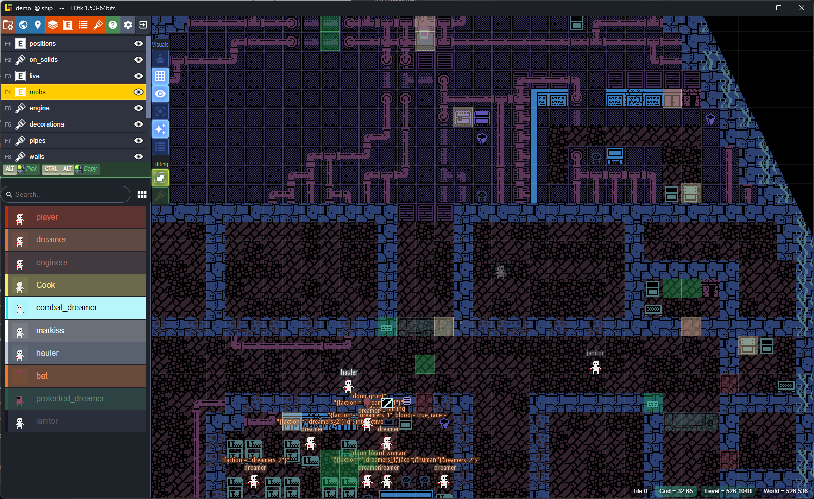

[\[Русский\]](/)

## About me



- Programming is my passion; in my free time, I develop games, software & support a [small open-source serialization library](#ldump)
- 4 years of commercial experience, 10 years overall (see my [github history](https://github.com/girvel))

### Skills

- Readable and maintainable code [\[1\]](https://github.com/girvel/fallen/blob/6403fa1b2e065861b3e76af4e1edf1e8ad09c3f0/tech/sound.lua) [\[2\]](https://github.com/girvel/ldump/blob/f644aafafadd49ca258d605bfaa1c05379577d30/init.lua) and documentation [\[3\]](https://github.com/girvel/ldump/blob/f644aafafadd49ca258d605bfaa1c05379577d30/README.md)
- Dynamic language code optimization
- Languages: Python, C#, Lua as main languages in a professional setting, a ton of languages on habitual level (JavaScript, C, Rust, Zig, ...)
- Backend keywords: FastAPI, Tarantool, Flask, PostgreSQL, Git, Docker, Shell, Linux
- Real-world languages: Russian (native), English


## Jobs

### Backend development freelance

*Aug 2023–Dec 2024*

- Stepped back from full-time work because of health issues
- Backend development on Python+FastAPI and Lua+Tarantool
- Work on personal projects (see [fallen](#fallen))

### Backend Developer (Fintech) - OneMarketData

*Feb 2022–Jul 2023*

- Processing and analyzing stock exchange data
- Ecosystem development for propritary DB
- Fancy clients: New York Stock Exchange, Credit Suisse, FCA

### Fullstack Developer - Лаборатория Кода

*Nov 2020–Oct 2021*

- Full-stack development for flask+plotly
- Writing internal CLI utilities
- Django, Flask, Docker

### Intern - Лаборатория Кода

*Sep 2020–Nov 2020*

- Python development for web & machine learning, data parsing


## Projects

### [ldump](https://github.com/girvel/ldump)

```lua
local ldump = require("ldump")

local upvalue = 42
local world = {
  name = "New world",
  get_answer = function() return upvalue end,
}

local serialized_data = ldump(world)  -- serialize to a string
local loaded_world = load(serialized_data)()  -- deserialize the string

assert.are_equal(world.name, loaded_world.name)
assert.are_equal(world.get_answer(), loaded_world.get_answer())
```

Robust serialization library supporting all Lua types and edge cases.

- Young active library (99 stars at the moment of writing)
- The only library that covers all possible cases, including full code serialization
- Thoroughly documented
- Thoroughly tested (34 tests automated to run on 5 Lua versions)

### [looper](https://github.com/girvel/looper)

<a target="_blank" href="./assets/looper.png"></a>

Repetitive task management utility for command line (for personal use); written in Rust using TOML + cron expressions.

- Minimalistic, fully solves the problem, and avoids unnecessary complexity

### [fallen](https://github.com/girvel/fallen)

<div style="display: inline;">
    <a target="_blank" href="./assets/fallen_01.png"></a>
    <a target="_blank" href="./assets/fallen_02.png"></a>
    <a target="_blank" href="./assets/fallen_03.png"></a>
    <a target="_blank" href="./assets/fallen_ldtk.png"></a>
</div>

2D mini-RPG adventure game; custom engine based on LOVE.

- Developed in a small team as a non-commercial passion project
- 17500 lines of code (from which 12500 is engine code), 1300 commits
- Asynchronous scripting engine
- Uses LDtk for visual level editing


## Contacts

- Email: [widauka@ya.ru](mailto://widauka@ya.ru)
- Telegram: [@girvel](https://t.me/girvel)
- Github: [@girvel](https://github.com/girvel)
